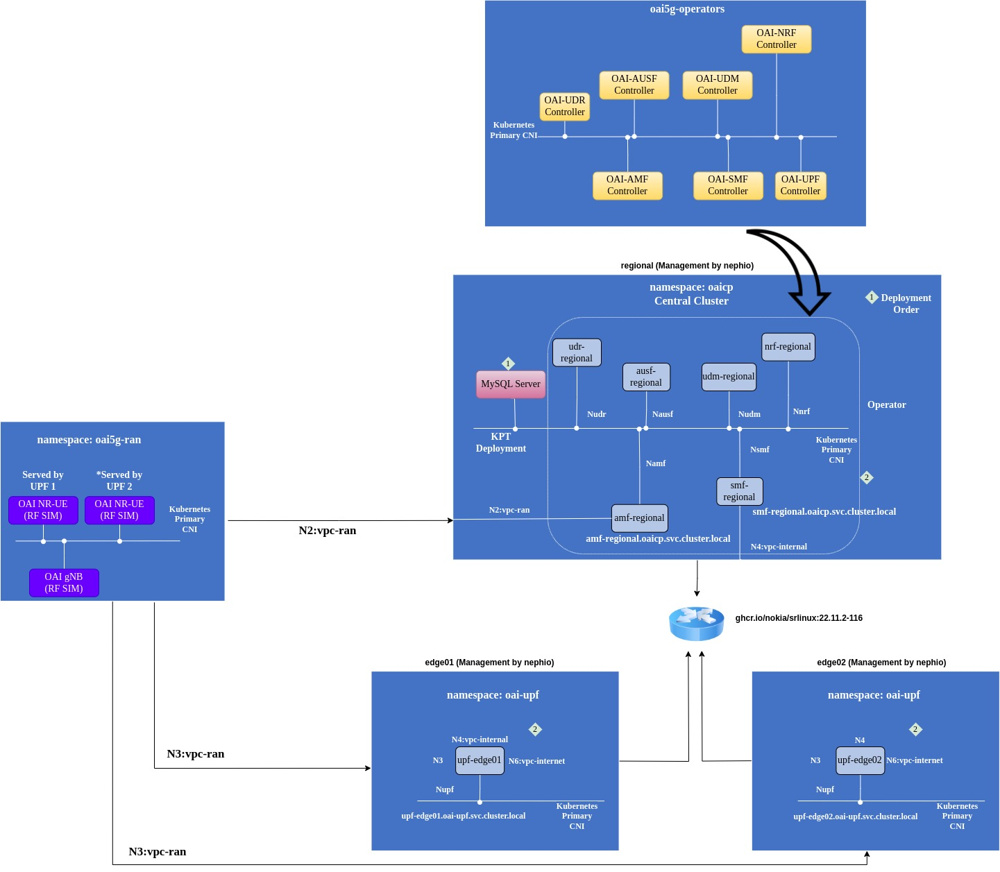

<table style="border-collapse: collapse; border: none;">
  <tr style="border-collapse: collapse; border: none;">
    <td style="border-collapse: collapse; border: none;">
      <a href="http://www.openairinterface.org/">
         
         </img>
      </a>
    </td>
    <td style="border-collapse: collapse; border: none; vertical-align: center;">
      <b><font size = "5">OpenAirInterface 5G Core Network Function Topology for Nephio</font></b>
    </td>
  </tr>
</table>

This repository contains Kpt packages and package variant sets for OAI operators and network functions. Designed for [Nephio](https://nephio.org/)

Git repository for OAI Operators --> `https://gitlab.eurecom.fr/development/oai-operators` 

Repository structure is below

```
.
├── database
├── docs
│   └── images
├── oai-amf
├── oai-ausf
├── oai-nrf
├── oai-nr-ue
│   └── nrue
├── oai-cp-operators
│   ├── crds
│   └── operator
├── oai-up-operators
│   ├── crds
│   └── operator
├── oai-repository
├── oai-rfsim-gnb
│   └── gnb
├── oai-smf
├── oai-udm
├── oai-udr
├── oai-upf-edge
├── package-variant
├── skupper-edge
└── skupper-regional
└── package-variant	Package variant for all nfs, database and operator
```

The package-variants are designed to deploy below architecture

 **TO BE UPDATED FOR R2**

**Disclaimer**

1. For the moment we are instantiating `oai-gnb` using its kpt package in `oai5g-ran` namespace and context `regional`. Rather than using a package variant. To do this we have to create a KRM function which we will do soon (in case someone is interested then please let us know). At the moment networking is manually set, gNB is using only 1 interface for n2 and n3 and it is in the same subnet of AMF.
2. At the moment the UE can not ping anywhere because the `network-vpc-internet` is not allocating the right subnet to UPFs. We are trying to solve it.

**NOTICE**

All the files are published under OAI license except the [crds](./oai-operators/crds) and the yaml definations provided by nephio.

# How deploy the toplogy on Nephio

## Step 0: Prerequisite

1. Make sure that you have a running regional, multiple edge cluster topology as defined in [nephio exercise](https://github.com/nephio-project/docs/blob/v1.0.1/user-guide/exercises.md). 

```bash
git clone https://github.com/OPENAIRINTERFACE/oai-packages.git
#TEMPORARY
git checkout r2
cd oai-packages
```

## Step 1: Adding oai-packages repository in nephio repo list

Right now we are providing the kpt package in this repository 

```bash
kpt live init oai-repository
kpt live apply oai-repository
```

<details>
<summary>The output is similar to:</summary>

```console
installing inventory ResourceGroup CRD.
inventory update started
inventory update finished
apply phase started
repository.config.porch.kpt.dev/oai-packages apply successful
apply phase finished
reconcile phase started
repository.config.porch.kpt.dev/oai-packages reconcile pending
repository.config.porch.kpt.dev/oai-packages reconcile successful
reconcile phase finished
inventory update started
inventory update finished
apply result: 1 attempted, 1 successful, 0 skipped, 0 failed
reconcile result: 1 attempted, 1 successful, 0 skipped, 0 failed, 0 timed out
```
</details>

To verify the repository is on-boarded

```bash
kubectl get repositories | grep oai-packages
```

<details>
<summary>The output is similar to:</summary>

```console
NAME                      TYPE   CONTENT   DEPLOYMENT   READY   ADDRESS
oai-packages              git    Package   false        True    https://github.com/OPENAIRINTERFACE/oai-packages
```
</details>

## Step 2: Deploy core network functions package variant

Now start deploying the core network function package variant starting with database. 

1. UDR requires that the database is running 
2. All AMF, SMF, UDR, UDM, AUSF will wait for NRF container to be healthy

```bash
kubectl apply -f package-variant/database.yaml
```
<details>
<summary>The output is similar to:</summary>

```console
packagevariantset.config.porch.kpt.dev/regional-oai-database created
```
</details>

After couple of seconds you will see database pod in regional cluster in `oai-core` namespace

```bash
kubectl get pods -n oai-core --context regional-admin@regional
```
<details>
<summary>The output is similar to:</summary>

```console
NAME                     READY   STATUS    RESTARTS   AGE
mysql-5c6cb749bc-nsdsp   1/1     Running   0          47s
```
</details>

Deploy operators on regional and edge clusters

```bash
kubectl apply -f package-variant/operators-cp.yaml
kubectl apply -f package-variant/operators-up.yaml
```
<details>
<summary>The output is similar to:</summary>

```console
packagevariant.config.porch.kpt.dev/oai-cp-operators created
packagevariant.config.porch.kpt.dev/oai-up-operators created
```
</details>

After couple of clusters oai-operator package will be in `main` branch of gitea repository of regional and edge01. To check if the pods are running

Core network control plane operators will be in regional cluster and user plane in edge cluster.

```bash
kubectl get pods -n oai-operators --context regional-admin@regional
kubectl get pods -n oai-operators --context edge01-admin@edge01
```
<details>
<summary>The output is similar to:</summary>

```console
## control plane
NAME                                   READY   STATUS    RESTARTS   AGE
oai-amf-controller-55dfbf8c4-9qdl4     1/1     Running   0          2m24s
oai-ausf-controller-769d64999f-28ntm   1/1     Running   0          2m24s
oai-nrf-controller-67f556bf75-8svd5    1/1     Running   0          2m24s
oai-smf-controller-5b6db9f5cb-klfsw    1/1     Running   0          2m24s
oai-udm-controller-867847d4cb-qdrzl    1/1     Running   0          2m24s
oai-udr-controller-764f4bfdb9-zw622    1/1     Running   0          2m24s
## user plane
NAME                                  READY   STATUS    RESTARTS   AGE
oai-upf-controller-75cbc869cb-zchjl   1/1     Running   0          11s
```
</details>


Deploy control plane network functions AMF, SMF, NRF, UDR, UDM, AUSF

```bash
kubectl apply -f package-variant/nrf.yaml
kubectl apply -f package-variant/udm.yaml
kubectl apply -f package-variant/udr.yaml
kubectl apply -f package-variant/ausf.yaml
kubectl apply -f package-variant/amf.yaml
kubectl apply -f package-variant/smf.yaml
```

In around 6-7 mins you will see all the control plane NFs in `oai-core` namespace in regional cluster.

```bash
kubectl get pods -n oai-core --context regional-admin@regional
```
<details>
<summary>The output is similar to:</summary>

```console
NAME                             READY   STATUS    RESTARTS      AGE
amf-regional-5667d55644-nkthg    1/1     Running   0             85s
ausf-regional-77867547bb-vl92j   1/1     Running   0             85s
mysql-5c6cb749bc-hn26d           1/1     Running   0             15m
nrf-regional-7c79d988f5-lszwk    1/1     Running   0             85s
smf-regional-5966dfd454-fc484    1/1     Running   0             82s
udm-regional-56f78c9c7c-44556    1/1     Running   0             85s
udr-regional-6f685c97db-2vrb7    1/1     Running   0             85s
```
</details>

Deploy UPF on edge site

```bash
kubectl apply -f package-variant/upf-edge.yaml
```

<details>
<summary>The output is similar to:</summary>

```console
packagevariant.config.porch.kpt.dev/edge-oai-upf created
```
</details>


In five mins you will see two upf instances in `oai-upf` namespace in edge01 cluster respectively. 

```bash
kubectl get pods -n oai-upf --context edge01-admin@edge01
```

<details>
<summary>The output is similar to:</summary>

```console
NAME                          READY   STATUS    RESTARTS   AGE
upf-edge01-696976df64-gwn42   1/1     Running   0          42m
```
</details>

## Step 3: Check if the PFCP session between UPF and SMF is established

It is really important that the PFCP session is established between SMF and UPF. If there is no PFCP session then there is no point in moving forward. To check the session you have to read the logs of SMF or UPF. 

```bash
kubectl logs -n oai-upf <edge01-upf-pod-name>  --context edge01-admin@edge01 | grep 'Received SX HEARTBEAT REQUEST' | wc -l
```

<details>
<summary>The output is similar to (any value more than one means that the session is established successfully):</summary>

```console
26
```
</details>

In case you don't see a session the mostly probably it is a networking issue in the setup and UPF is not able to reach the SMF n4 ip-address. To check this we suggest that you go inside the SMF pod and install `tcpdump` and ping `n4` ip-address of UPF. 

## Step 4: Deploying OAI-GNB and OAI-NR-UE

For the moment we are instantiating `oai-gnb` using its kpt package in `oai5g-ran` namespace and context `regional`. Rather than using a package variant. To do this we have to create a KRM function which we will do soon (in case someone is interested then please let us know). At the moment networking is manually set, gNB is using only 1 interface for n2 and n3 and it is in the same subnet of AMF.

1. Fetch the ip-address and gateway of AMF from `AMFDeployment` using `jq` or `grep`. If you don't have jq utility then I recommend you to install it. 

```bash
kubectl get amfdeployments.workload.nephio.org -n oaicp --context regional-admin@regional -o json | jq -r .items[0].spec.interfaces[0].ipv4.address
kubectl get amfdeployments.workload.nephio.org -n oaicp --context regional-admin@regional -o json | jq -r .items[0].spec.interfaces[0].ipv4.gateway
```

<details>
<summary>The output is similar to:</summary>

```console
172.2.1.254/24
172.2.1.1
```
</details>

2. Once you have the ip-address of amf then choose any other ip-address in this range and replace `gnbNgaIpAddress` and `gnbNguIpAddress` with the choosen ip-address and replace `amfIpAddress` with the amf ip-address in [oai-gnb/oai-gnb.yaml](./oai-gnb/oai-gnb.yaml).
When you add amf ip-address please remove the subnet mask `/24`. In the same file you have to replace the ip-addresses for `NetworkAttachmentDefinition`. In the filed `address` you have to put the ip-address of gNB which you selected and in `gw` you have to mention the `gateway` of amf.


```bash
kpt fn render oai-gnb
kpt live init oai-gnb --context regional-admin@regional
kpt live apply oai-gnb --context regional-admin@regional
```

Once the pod is running you can check it using below command

```bash
kubectl get pods -n oai5g-ran --context regional-admin@regional
```

<details>
<summary>The output is similar to:</summary>

```console
NAME                           READY   STATUS    RESTARTS   AGE
oaignb-67b99b95dd-vrkzb        1/1     Running   0          3m30s
```
</details>


Verify that AMF has registered the gNB via checking the logs of AMF. 

```bash
kubectl logs <amf-regional-pod-name> -n oaicp --context regional-admin@regional
```

You should see that the gNB is connected. 

After this install `oai-nr-ue` kpt package in context regional. 

```bash
kpt fn render oai-nr-ue
kpt live init oai-nr-ue --context regional-admin@regional
kpt live apply oai-nr-ue --context regional-admin@regional
```
Check that the UE pod is up and running

```bash
kubectl get pods -n oai5g-ran --context regional-admin@regional
```

<details>
<summary>The output is similar to:</summary>

```console
NAME                           READY   STATUS    RESTARTS   AGE
oai-nr-ue-75d46ff4fd-qxsh8   1/1     Running   0          48s
oaignb-67b99b95dd-vrkzb        1/1     Running   0          3m30s
```
</details>

You will see that the ue is connected once `oaitun_ue1` tunnel interface is up. 

```bash
kubectl exec -it <oai-nr-ue-pod-name> -n oai5g-ran --context regional-admin@regional ifconfig oaitun_ue1
```

<details>
<summary>The output is similar to:</summary>

```console
oaitun_ue1: flags=4305<UP,POINTOPOINT,RUNNING,NOARP,MULTICAST>  mtu 1500
        inet 10.1.0.2  netmask 255.255.255.0  destination 10.1.0.2
        inet6 fe80::7e3:e22c:c066:d079  prefixlen 64  scopeid 0x20<link>
        unspec 00-00-00-00-00-00-00-00-00-00-00-00-00-00-00-00  txqueuelen 500  (UNSPEC)
        RX packets 0  bytes 0 (0.0 B)
        RX errors 0  dropped 0  overruns 0  frame 0
        TX packets 5  bytes 240 (240.0 B)
        TX errors 0  dropped 0 overruns 0  carrier 0  collisions 0
```
</details>
